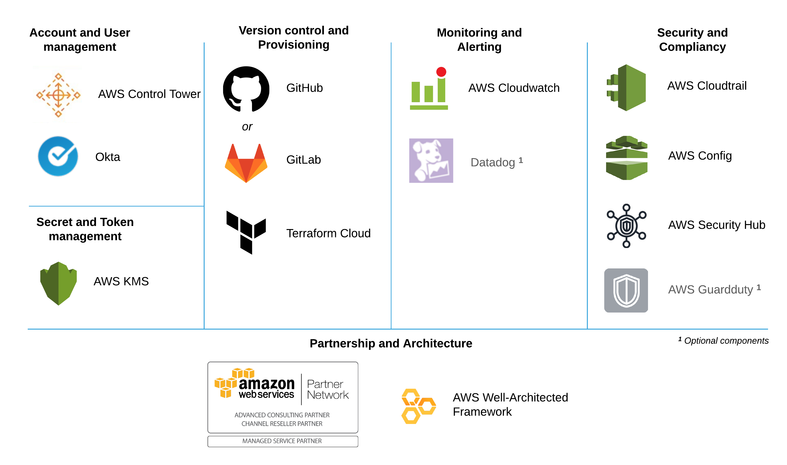

# terraform-aws-mcaf-landing-zone
Terraform module to setup and manage various components of the AWS Landing Zone.

Overview of Landing Zone tools & services: 

 

## AWS CloudTrail

By default, all CloudTrail logs will be stored in a S3 bucket in the `logging` account of your AWS Organization. However, this module also supports creating an additional CloudTrail configuration to publish logs to any S3 bucket chosen by you. This trail will be set at the Organization level, meaning that logs from all accounts will be published to the provided bucket.

NOTE: Before enabling this feature, make sure that the [bucket policy authorizing CloudTrail to deliver logs](https://aws.amazon.com/premiumsupport/knowledge-center/change-cloudtrail-trail/) is in place and that you have enabled [trusted access between AWS Organizations and CloudTrail](https://docs.aws.amazon.com/organizations/latest/userguide/services-that-can-integrate-cloudtrail.html#integrate-enable-ta-cloudtrail). If these two steps are not in place, Terraform will fail to create the trail.

Example:

```hcl
additional_auditing_trail = {
  name   = "additional_auditing_trail"
  bucket = "bucket_name"
}
```

## AWS Config Rules

This module provisions by default a set of basic AWS Config Rules. In order to add extra rules, a list of [rule identifiers](https://docs.aws.amazon.com/config/latest/developerguide/managed-rules-by-aws-config.html) can be passed via the variable `aws_config` using the attribute `rule_identifiers`.

If you would like to authorize other accounts to aggregate AWS Config data, the account IDs and regions can also be passed via the variable `aws_config` using the attributes `aggregator_account_ids` and `aggregator_regions` respectively. 

NOTE: This module already authorizes the `audit` account to aggregate Config data from all other accounts in the organization, so there is no need to specify the `audit` account ID in the `aggregator_account_ids` list.

Example:

```hcl
aws_config = {
  aggregator_account_ids = ["123456789012"]
  aggregator_regions     = ["eu-west-1"]
  rule_identifiers       = ["ACCESS_KEYS_ROTATED", "ALB_WAF_ENABLED"]
}
```

## AWS GuardDuty

This module supports enabling GuardDuty at the organization level which means that all new accounts that are created in, or added to, the organization are added as a member accounts of the `audit` account GuardDuty detector.

This feature can be controlled via the `aws_guardduty` variable and is enabled by default.

Note: In case you are migrating an existing AWS organization to this module, all existing accounts except for the `master` and `logging` accounts have to be enabled like explained [here](https://docs.aws.amazon.com/guardduty/latest/ug/guardduty_organizations.html#guardduty_add_orgs_accounts).

## Datadog Integration

This module supports an optional Datadog-AWS integration. This integration makes it easier for you to forward metrics and logs from your AWS account to Datadog.

In order to enable the integration, you can pass an object to the variable `datadog` containing the following attributes:

- `api_key`: sets the Datadog API key
- `enable_integration`: set to `true` to configure the [Datadog AWS integration](https://docs.datadoghq.com/integrations/amazon_web_services/)
- `install_log_forwarder`: set to `true` to install the [Datadog Forwarder](https://docs.datadoghq.com/serverless/forwarder/)

In case you don't want to use the integration, you can configure the Datadog provider like in the example below:

```hcl
provider "datadog" {
  validate = false
}
```

This should prevent the provider from asking you for a Datadog API Key and allow the module to be provisioned without the integration resources.

## Monitoring IAM Access

This module automatically monitors and notifies all activities performed by the `root` user of all core accounts. All notifications will be sent to the SNS Topic `LandingZone-MonitorIAMAccess` in the `audit` account.

In case you would like to monitor other users or roles, a list can be passed using the variable `monitor_iam_access`. All objects in the list should have the attributes `account`, `name` and `type`. 

The allowed values are:

- `account`: `audit`, `logging` or `master`
- `name`: the name of the IAM Role or the IAM User
- `type`: `AssumedRole` or `IAMUser` 

For more details regarding identities, please check [this link](https://docs.aws.amazon.com/awscloudtrail/latest/userguide/cloudtrail-event-reference-user-identity.html).

NOTE: Data Sources will be used to make sure that the identities provided actually exist in each account to avoid monitoring non-existent resources. In case an invalid identity is provided, a `NoSuchEntity` error will be thrown. 

Example:

```hcl
monitor_iam_access = [
  {
    account = "master"
    name    = "AWSReservedSSO_AWSAdministratorAccess_123abc"
    type    = "AssumedRole"
  }
]
```

## Service Control Policies (SCPs)

Service control policies (SCPs) are a type of organization policy that you can use to manage permissions in your organization. See [this page](https://docs.aws.amazon.com/organizations/latest/userguide/orgs_manage_policies_scps.html) for an introduction to SCPs and the value they add.

This module allows using various SCPs as described below. We try to adhere to best practices of not attaching SCPs to the root of the organisation when possible; in the event you need to pass a list of OU names, be sure to have the exact name as the matching is case sensitive.

### Deny ability to leave Organization

Enabling this SCP removes a member account's ability to leave the AWS organisation.

This is SCP is enabled by default, but can be disabled by setting `aws_deny_leaving_org` variable to `false`.

### Require the use of Instance Metadata Service Version 2

By default, all EC2s still allow access to the original metadata service, which means that if an attacker finds an EC2 running a proxy or WAF, or finds and SSRF vulnerability, they likely can steal the IAM role of the EC2. By enforcing IMDSv2, you can mitigate that risk. Be aware that this potentially could break some applications that have not yet been updated to work with the new IMDSv2.

This is SCP is enabled by default, but can be disabled by setting `aws_require_imdsv2` variable to `false`.

### Restricting AWS Regions

If you would like to define which AWS Regions can be used in your AWS Organization, you can pass a list of region names to the variable `aws_region_restrictions` using the `allowed` attribute. This will trigger this module to deploy a [Service Control Policy (SCP) designed by AWS](https://docs.aws.amazon.com/organizations/latest/userguide/orgs_manage_policies_scps_examples.html#example-scp-deny-region) and attach it to the root of your AWS Organization.

In case you would like to exempt specific IAM entities from the region restriction, you can pass a list of ARN patterns using the `exceptions` attribute. This can be useful for roles used by AWS ControlTower, for example, to avoid preventing it from managing all regions properly.

Example:

```hcl
aws_region_restrictions = {
  allowed    = ["eu-west-1"]
  exceptions = ["arn:aws:iam::*:role/RoleAllowedToBypassRegionRestrictions"]
}
```

### Restricting Root User Access

If you would like to restrict the root user's ability to log into accounts in an OU, you can pass a list of OU names to the `aws_deny_root_user_ous` variable.

Example showing SCP applied to all OUs except the Root OU:

```hcl
data "aws_organizations_organization" "default" {}

data "aws_organizations_organizational_units" "default" {
  parent_id = data.aws_organizations_organization.default.roots[0].id
}

module "landing_zone" {
  ...

  aws_deny_root_user_ous = [
    for ou in data.aws_organizations_organizational_units.default.children : ou.name if ou.name != "Root"
  ]
```

### Enable SNS topic subscription

To subscribe to the `AggregatedSecurityNotifications` topic to receive security findings, set the `sns_security_subscription` variable as shown below.

Example for https protocol and specified webhook endpoint:

```hcl
module "landing_zone" {
  ...
  
  sns_security_subscription = {
    endpoint = "https://app.datadoghq.com/intake/webhook/sns?api_key=qwerty0123456789"
    protocol = "https"
  }
}
```


<!--- BEGIN_TF_DOCS --->
## Requirements

| Name | Version |
|------|---------|
| terraform | >= 0.13 |
| aws | >= 3.16.0 |
| okta | >= 3.0 |

## Providers

| Name | Version |
|------|---------|
| aws | >= 3.16.0 |
| aws.audit | >= 3.16.0 |
| aws.logging | >= 3.16.0 |
| okta | >= 3.0 |

## Inputs

| Name | Description | Type | Default | Required |
|------|-------------|------|---------|:--------:|
| aws\_sso\_acs\_url | AWS SSO ACS URL for the Okta App | `string` | n/a | yes |
| aws\_sso\_entity\_id | AWS SSO Entity ID for the Okta App | `string` | n/a | yes |
| control\_tower\_account\_ids | Control Tower core account IDs | <pre>object({<br>    audit   = string<br>    logging = string<br>  })</pre> | n/a | yes |
| tags | Map of tags | `map(string)` | n/a | yes |
| additional\_auditing\_trail | CloudTrail configuration for additional auditing trail | <pre>object({<br>    name   = string<br>    bucket = string<br>  })</pre> | `null` | no |
| aws\_config | AWS Config settings | <pre>object({<br>    aggregator_account_ids = list(string)<br>    aggregator_regions     = list(string)<br>  })</pre> | `null` | no |
| aws\_deny\_leaving\_org | Enable SCP that denies accounts the ability to leave the AWS organisation | `bool` | `true` | no |
| aws\_deny\_root\_user\_ous | List of AWS Organisation OUs to apply the "DenyRootUser" SCP to | `list(string)` | `[]` | no |
| aws\_guardduty | Whether AWS GuardDuty should be enabled | `bool` | `true` | no |
| aws\_okta\_group\_ids | List of Okta group IDs that should be assigned the AWS SSO Okta app | `list(string)` | `[]` | no |
| aws\_region\_restrictions | List of allowed AWS regions and principals that are exempt from the restriction | <pre>object({<br>    allowed    = list(string)<br>    exceptions = list(string)<br>  })</pre> | `null` | no |
| aws\_require\_imdsv2 | Enable SCP which requires EC2 instances to use V2 of the Instance Metadata Service | `bool` | `true` | no |
| datadog | Datadog integration options for the core accounts | <pre>object({<br>    api_key               = string<br>    enable_integration    = bool<br>    install_log_forwarder = bool<br>    site_url              = string<br>  })</pre> | `null` | no |
| monitor\_iam\_access | List of IAM Identities that should have their access monitored | <pre>list(object({<br>    account = string<br>    name    = string<br>    type    = string<br>  }))</pre> | `null` | no |
|sns_security_subscription | Aggregated security SNS topic subscription | <pre>list(object({<br>    sns_endpoint          = string<br>    sns_endpoint_protocol = string<br>  }))</pre> | `null` | no |

## Outputs

| Name | Description |
|------|-------------|
| kms\_key\_arn | ARN of KMS key for SSM encryption |
| kms\_key\_id | ID of KMS key for SSM encryption |
| monitor\_iam\_access\_sns\_topic\_arn | ARN of the SNS Topic in the Audit account for IAM access monitoring notifications |

<!--- END_TF_DOCS --->
